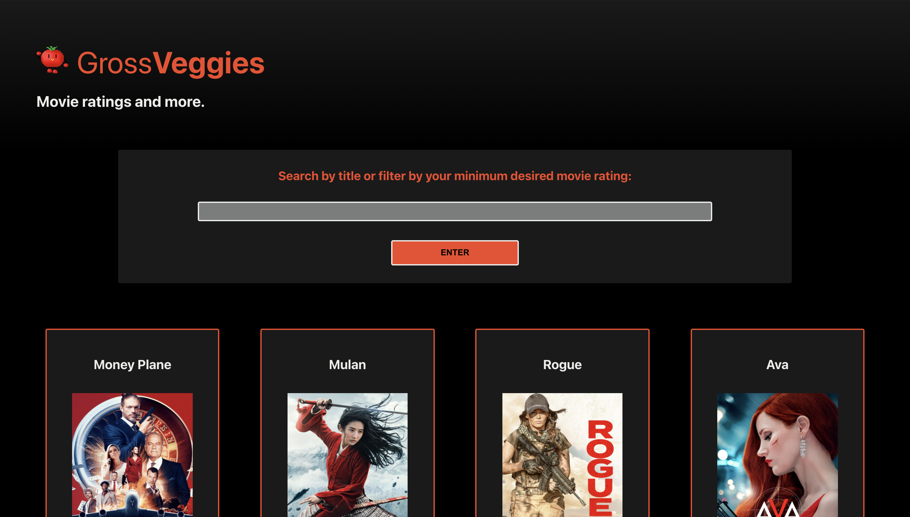
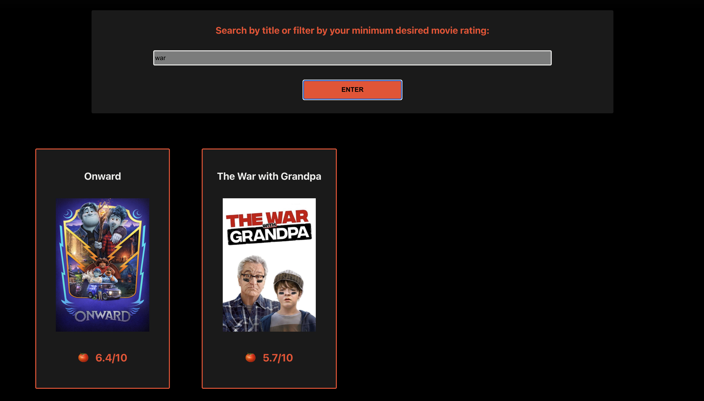
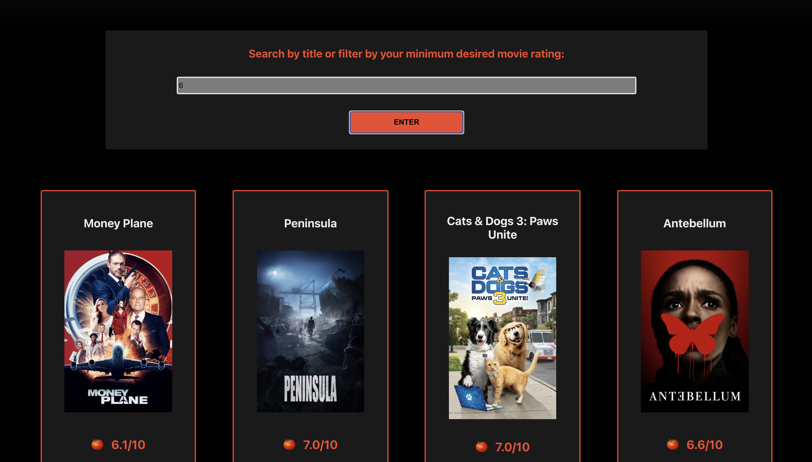
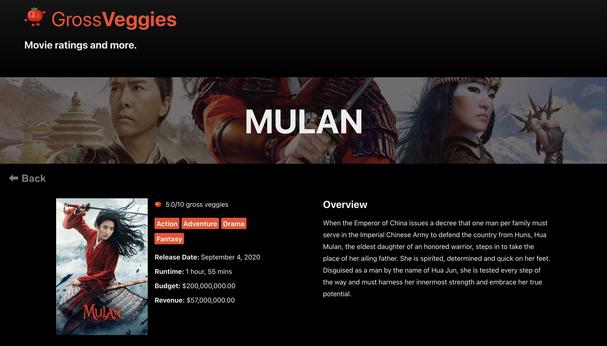
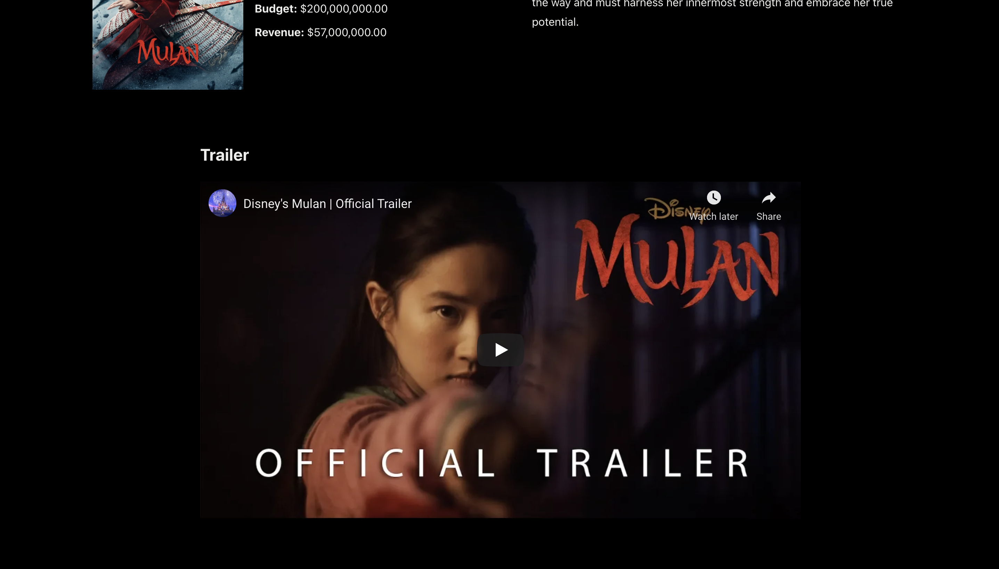

# 🍅 Gross**Veggies**
###### Movie ratings and more.
---
## Table of Contents
* [Introduction](#introduction)
* [Features](#features)
* [Cypress Testing](#cypress-testing)
* [Technologies](#technologies)
* [Deployment](#deployment)
* [Authors](#authors)

## Introduction
[GrossVeggies](https://github.com/Max9545/Rancid-Tomatillos) (a.k.a Rancid Tomatillos, but definitely not Rotten Tomatoes) helps visitors discover and learn more about movies. They can search by title, filter by minimum "gross veggies" rating, and click on a movie poster to view additional movie details and trailers. The project specifications can be found [here](https://frontend.turing.io/projects/module-3/rancid-tomatillos-v3.html).

## Motivation
The goals of this project were to:
* Gain competency with React fundamentals
* Learn how to test React components & asynchronous JS
* Practice refactoring
* Create a multi-page UX using Router

---

## Features
* [Display Movies](#Display-Movies)
* [Search Movie Titles](#Search-Movie-Titles)
* [Filter By Rating](#Filter-By-Rating)
* [View Movie Details](#View-Movie-Details)
* [View Trailers](#View-Trailers)
* [React Router](#React-Router)

#### Display Movies
When the site loads, you'll see an adorable dancing tomato gif, a search box, and a grid of movie posters.

    

      
Under the Hood

      Movies are rendered using `fetch` to request movie data from the API in the `componentDidMount` method in `App`. Then, relevant props are passed down to the `Homepage` and `Poster` components.
    

#### Search Movie Titles
Look up a movie quickly by typing the title (or part of one) into the search input and hit `enter` to filter by movie title.

    

      
Under the Hood

      We created a `Form` component and updated state based on the input value. On submit, the search value is passed up to `App` and runs through a filter method to tell the `Homepage` component what movies it should render.
    

#### Filter By Rating
No one wants to watch bad movies! Filter by minimum desired movie rating by typing a number between 1-7 into the search bar and clicking `enter` (the highest rating doesn't go above 7).

    

      
Under the Hood

      Works similar to the "Search Movie Titles" feature except that the method in `App` will filter by rating if the search value is a number.
    

#### View Movie Details
A user can click on a movie to view more details about it.

    

      
Under the Hood

      Movie details are fetched from a unique API endpoint that matches the id of the poster that was clicked (via Router). In the render, incoming data is formatted to be more readable for the user.
    

#### View Trailers
When a user clicks on a movie poster to view details, they can play its trailer (embedded from YouTube).

    

      
Under the Hood

      Trailers are fetched from a unique API endpoint that matches the id of the current movie. Then, it's rendered using a package called [React Player](https://www.npmjs.com/package/react-player).
    

#### React Router
When a user clicks on a movie and the details page is rendered, the URL updates to reflect that movie's unique ID. The user can also click the browser forward and back buttons to navigate.

#### Accessibility
This app was built with all users in mind. We used Lighthouse and [WAVE](https://wave.webaim.org/) to work towards including as broad of an audience as we could. Of course, as we are committed to including all users, we are ready to make future edits to address any areas that we may have missed.

#### Continuous Improvement/Future Improvements
This project was a nice way for us to work together to learn React and all the fun things that come along with it (Router, Cypress, JSX, and overall an entirely different way of approaching building a web application). While we're happy with the outcome, we feel that the site itself is a bit simple and are eager to add more features!

First, we'd like to continue building out the search & filter functionality to include genres, title, year released, and runtime. We want to add a "Clear Search" button to improve the UX.

We'd also like to take advantage of the user APIs provided to us to make the site more interactive. User stories for this would include:
* As a regular user, I want to login so that I can add movie ratings
* As a regular user, I want to submit a new movie rating so that I can recommend it to others (or not).
* As a regular user, I want to be able to see all my past movie ratings so that I can decide if I want to watch it again.
* As a regular user, I want to be able to delete a movie review that I’ve given in case I change my mind about it.

---

## Technologies
JavaScript, React, RESTful APIs, React Router, Cypress, HTML, CSS

## Cypress Testing
We learned how to use Cypress for end-to-end integration testing, including stubbing and testing async functionality, testing all user flows, and happy/sad paths.

## Deployment
[Deployment Link](https://rancid-tomatillos-six.vercel.app/)

**To run locally:**
1. Clone down this repo
2. Run `npm i`
3. Run `npm start`

## Authors
<table>
    <tr>
        <td> Max Bregman <a href="https://github.com/Max9545">GH</td>
        <td> Tashia Davis <a href="https://github.com/tashiad">GH</td>
    </tr>
<td></td>
 <td></td>
</table>
